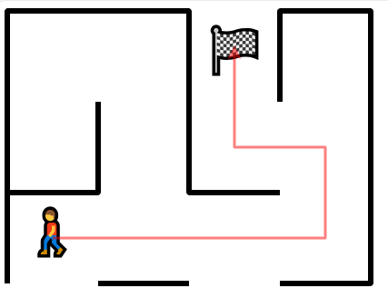

# Maze Solver

This project aims to create an automated maze solver. The program reads the binary file and then solves it using Dijkstra's Algorithm. Finally, it will output the solution in a .svg file. 

## Installation and Running the Code

Set up the python virtual environment.
```
python -m venv .venv
```

Start the virtual environment.
```
.venv\Scripts\activate
```

Run the code. You may then view the results in `maze.svg` under the `static` folder. 
```
python -m src.main
```

After you are done, you may deactivate your virtual environment. 
```
deactivate
```

## Discussion

The project successfully takes in the binary file labelled `miniature.maze` in `static` folder, which is a miniature maze and solves it. However, the program can only accept binary file of a specified format, as generated by this program using the `dump` method in `persistence\serializer.py`. It successfully outputs the solution, allowing users to view the shortest possible solution of the maze. 

A sample output of the program is shown below: 



## Acknowledgements

I would like to express my thanks to the follownig resources:
- [Build a Maze Solver in Python Using Graphs](https://realpython.com/python-maze-solver/): For providing inspiration and guidance for this project
- [How Dijkstra's Algorithm Works](https://www.youtube.com/watch?v=EFg3u_E6eHU): For helping me to understand Dijkstra's Algorithm
