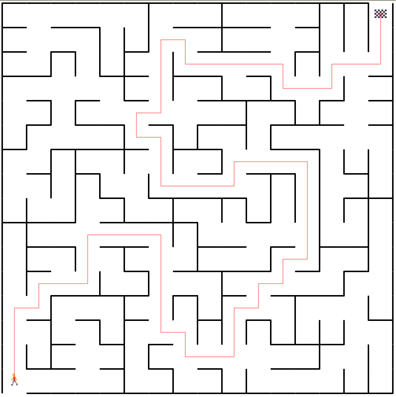

# Maze Solver

This project aims to create an automated maze solver. The main program reads the binary input file that describes the maze and then solves the maze using a shortest path algorithm, more specifically the Dijkstra's Algorithm. Finally, it will output the solution, offering the exact path in a temporary svg file that is displayed on a web browser. A sample output of the solution is shown below: 



As an extension, this project also contains a maze generation code which generates a maze to be solved. The maze is generated using Wilson's Algorithm, which leverages on the concept of loop erase random walk to generate an unbiased outcome. The maze will then be stored in a binary input file which can be used as the input file of the solver. The solved maze above is generated by this program. 

## Installation and Running the Code

Set up the python virtual environment.
```
python -m venv .venv
```

Start the virtual environment.
```
.venv\Scripts\activate
```

Install required libraries
```
pip install -r requirements.txt
```

Run the solver. 
```
python -m src.main
```

Or if you prefer to run the maze generator.
```
python -m src.generation.modeler
```

Upon completion, you may deactivate your virtual environment. 
```
deactivate
```

## Acknowledgements

I would like to express my thanks to the following resources:
- [Build a Maze Solver in Python Using Graphs](https://realpython.com/python-maze-solver/)
- [How Dijkstra's Algorithm Works](https://www.youtube.com/watch?v=EFg3u_E6eHU)
